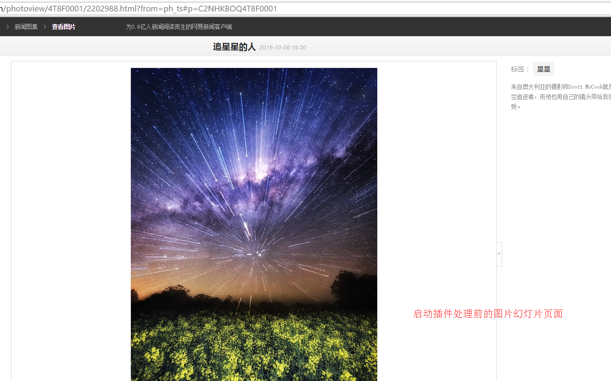
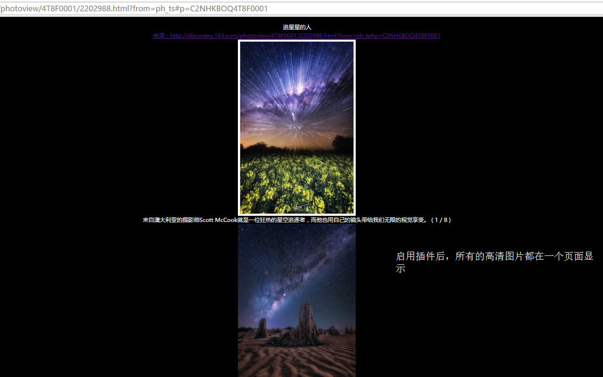

# Web图片浏览助手

## 概述

直接把腾讯图片新闻、网易图片新闻等国内几大媒体的幻灯图片的高清大图显示在页面内，方便下载和收藏到云笔记本

显示当前页面的所有图片，和其他插件不同的是，它主要针对国内几大新闻网站的图片频道的幻灯片页面。当我们浏览这些带幻灯片播放的页面，这个插件会分析页面信息，把所有的高清图片显示在当前页面上，方便大家进行批量保存和剪贴到云笔记当中。

目前支持的网站：腾讯图片、网易新闻图片、头条图片、凤凰图片新闻以及新浪图片新闻。

对于不支持网站，直接显示当前页面的所有图片。

## 效果

开启插件之前，页面使用的是幻灯片播放器来播放图片

开启插件之后，所有的高清大图都显示在一个页面上

